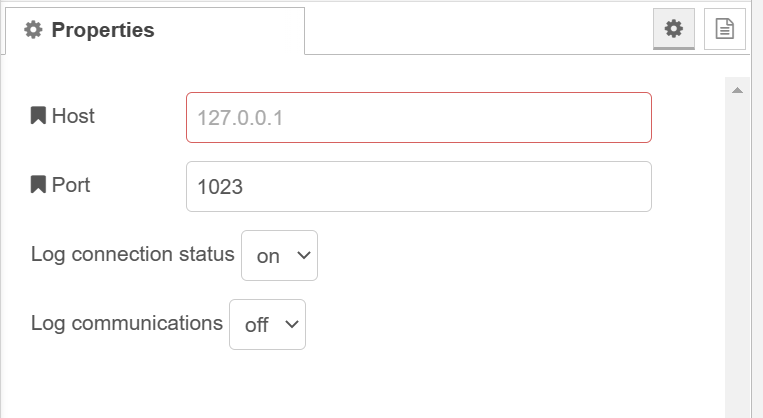
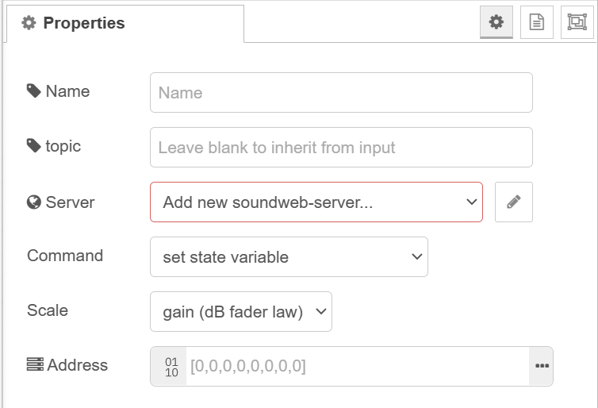
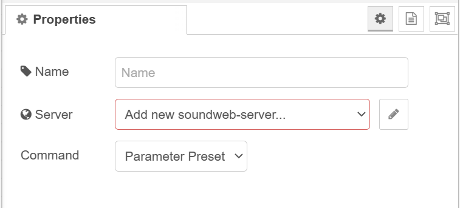

[](https://nodered.org)


# node-red-contrib-soundweb
A collection of nodes for controlling BSS Soundweb devices.

**IMPORTANT: v1.0.3 is a flow breaking update. Rather than have a node for each scale type and/or command type, functionality has been consolidated into as few nodes as possible. This is to simplify maintenance and updates.**

---

# Getting Started

## Prerequisites

- [Node.js](https://nodejs.org/en/) v12.13.0 or newer
- [Node-RED](https://nodered.org) v3.0.1 or newer

*untested on earlier versions*

## Installation

Install via Node-RED Manage Palette

`node-red-contrib-soundweb`

Install via npm

```
$ cd ~/.node-red
$ npm install node-red-contrib-soundweb
# then restart node-red
```

---

# Nodes

## soundweb-server

Configuration node that manages connection to BSS device.



## soundweb-Control

Node for setting a controls value.

There are two command types:

- set state variable
- set state variable by percentage

There are six scale types:

- discrete
- scalar linear
- gain (dB fader law)
- delay
- frequency
- speed



## soundweb-Presets

Node for recalling presets by index number. This node can recall *parameter* and *venue* presets.



# Resources

- [Soundweb London DI Kit](https://bssaudio.com/en/site_elements/soundweb-london-di-kit)
- [Soundweb London 3rd Party Control](https://help.harmanpro.com/Documents/135/Soundweb%20London%203rd%20Party%20Control.pdf)

## Address Property

The address property is a buffer of exactly 8 bytes. it is comprised of:

- Node Address (2 bytes)
- Virtual Device (1 byte)
- Object ID (3 bytes)
- Parameter ID (2 bytes)

The following bytes have special meanings. The node suite will automatically handle replacement when commands are encapsulated and decapsulated. Be mindfull on nodes requiring an address property that the **non replaced** character is needed in decimal format. 

| TYPE   | HEX  | DEC  | HEX replacement | DEC replacement |
| ------ |:----:| :---:| :-------------: | :-------------: |
| STX    | 0x02 | 2    | 0x1B, 0x82      | 27, 130         |
| ETX    | 0x03 | 3    | 0x1B, 0x83      | 27, 131         |
| ACK    | 0x06 | 6    | 0x1B, 0x86      | 27, 134         |
| NAK    | 0x15 | 21   | 0x1B, 0x95      | 27, 149         |
| Escape | 0x1B | 27   | 0x1B, 0x9B      | 27, 155         |

# Feature Requests / Bug Reporting

Please report any bugs or issues to the repository [here](https://github.com/dudest/node-red-contrib-soundweb/issues).