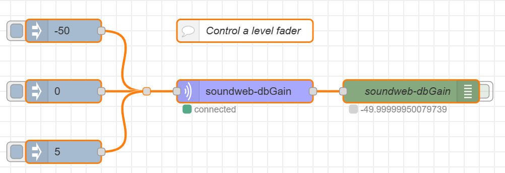
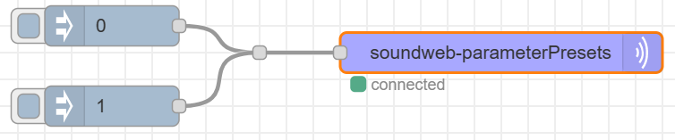

# node-red-contrib-soundweb
A collection of nodes for controlling BSS Soundweb devices.

---

# Getting Started

## Prerequisites

- [Node.js](https://nodejs.org/en/) v18.12.1 or newer
- [Node-RED](https://nodered.org) v3.0.1 or newer

*untested on earlier versions*

## Installation

Install via Node-RED Manage Palette

`node-red-contrib-soundweb`

Install via npm

```
$ cd ~/.node-red
$ npm install node-red-contrib-soundweb
# then restart node-red
```

## Resources

- [Soundweb London DI Kit](https://bssaudio.com/en/site_elements/soundweb-london-di-kit)
- [Soundweb London 3rd Party Control](https://help.harmanpro.com/Documents/135/Soundweb%20London%203rd%20Party%20Control.pdf)

---

# USAGE

## Server Property

**IP address** and **port** of BSS device.

## Address Property

All nodes except the `soundweb-Preset` node require an address be specifie. The address property is a buffer of exactly 8 bytes. it is comprised of:

- Node Address (2 bytes)
- Virtual Device (1 byte)
- Object ID (3 bytes)
- Parameter ID (2 bytes)

The following bytes have special meanings. The node suite will automatically handle replacement when commands are encapsulated and decapsulated. Be mindfull on nodes requiring an address property that the **non replaced** character is needed in decimal format. 

| TYPE   | HEX  | DEC  | HEX replacement | DEC replacement |
| ------ |:----:| :---:| :-------------: | :-------------: |
| STX    | 0x02 | 2    | 0x1B, 0x82      | 27, 130         |
| ETX    | 0x03 | 3    | 0x1B, 0x83      | 27, 131         |
| ACK    | 0x06 | 6    | 0x1B, 0x86      | 27, 134         |
| NAK    | 0x15 | 21   | 0x1B, 0x95      | 27, 149         |
| Escape | 0x1B | 27   | 0x1B, 0x9B      | 27, 155         |

---

# Examples

## soundweb-dbGain

Control a level fader using dB value.



```
[{"id":"b808bfbecab9467d","type":"tab","label":"soundweb-dbGain","disabled":false,"info":""},{"id":"039149f2e96d9e36","type":"junction","z":"b808bfbecab9467d","x":260,"y":180,"wires":[["01d5502d15917b77"]]},{"id":"75be45758a7b2fa9","type":"debug","z":"b808bfbecab9467d","name":"soundweb-dbGain","active":false,"tosidebar":true,"console":false,"tostatus":true,"complete":"payload","targetType":"msg","statusVal":"payload","statusType":"auto","x":610,"y":180,"wires":[]},{"id":"01d5502d15917b77","type":"soundweb-dbGain","z":"b808bfbecab9467d","name":"","topic":"","server":"5360e8d16d24bed6","address":"[0,9,3,0,1,0,0,0]","addressType":"bin","x":390,"y":180,"wires":[["75be45758a7b2fa9"]]},{"id":"32b96062ce029306","type":"inject","z":"b808bfbecab9467d","name":"","props":[{"p":"payload"},{"p":"topic","vt":"str"}],"repeat":"","crontab":"","once":false,"onceDelay":0.1,"topic":"","payload":"-50","payloadType":"num","x":150,"y":100,"wires":[["039149f2e96d9e36"]]},{"id":"a6646a6c14e240f8","type":"inject","z":"b808bfbecab9467d","name":"","props":[{"p":"payload"},{"p":"topic","vt":"str"}],"repeat":"","crontab":"","once":false,"onceDelay":0.1,"topic":"","payload":"0","payloadType":"num","x":150,"y":180,"wires":[["039149f2e96d9e36"]]},{"id":"1bf5690f659c3e4f","type":"inject","z":"b808bfbecab9467d","name":"","props":[{"p":"payload"},{"p":"topic","vt":"str"}],"repeat":"","crontab":"","once":false,"onceDelay":0.1,"topic":"","payload":"5","payloadType":"num","x":150,"y":260,"wires":[["039149f2e96d9e36"]]},{"id":"49c758e4300cb68e","type":"comment","z":"b808bfbecab9467d","name":"Control a level fader","info":"","x":390,"y":100,"wires":[]},{"id":"5360e8d16d24bed6","type":"soundweb-server","host":"10.0.0.234","port":"1023"}]
```

## soundweb-variable

Control a non scaled value; i.e. mute button, source selector, etc.


```
[{"id":"e2465d3b8b923c86","type":"tab","label":"soundweb-variable","disabled":false,"info":"","env":[]},{"id":"a95660a4ff2ed021","type":"comment","z":"e2465d3b8b923c86","name":"Set a variable; i.e. mute, source selector, etc.","info":"","x":430,"y":140,"wires":[]},{"id":"330e7234148567cf","type":"soundweb-variable","z":"e2465d3b8b923c86","name":"","topic":"","server":"5360e8d16d24bed6","address":"[0,9,3,0,1,0,0,1]","addressType":"bin","x":350,"y":200,"wires":[["cd7df45776dc28aa"]]},{"id":"cd7df45776dc28aa","type":"debug","z":"e2465d3b8b923c86","name":"soundweb-variable","active":false,"tosidebar":true,"console":false,"tostatus":true,"complete":"payload","targetType":"msg","statusVal":"payload","statusType":"auto","x":590,"y":200,"wires":[]},{"id":"555d7e3c31b55735","type":"inject","z":"e2465d3b8b923c86","name":"","props":[{"p":"payload"},{"p":"topic","vt":"str"}],"repeat":"","crontab":"","once":false,"onceDelay":0.1,"topic":"","payload":"0","payloadType":"num","x":150,"y":180,"wires":[["330e7234148567cf"]]},{"id":"7adee4c287332b92","type":"inject","z":"e2465d3b8b923c86","name":"","props":[{"p":"payload"},{"p":"topic","vt":"str"}],"repeat":"","crontab":"","once":false,"onceDelay":0.1,"topic":"","payload":"1","payloadType":"num","x":150,"y":260,"wires":[["330e7234148567cf"]]},{"id":"5360e8d16d24bed6","type":"soundweb-server","host":"10.0.0.234","port":"1023"}]
```

## soundweb-parameterPresets

Recall a parameter preset



```
[{"id":"7cf2b46d3c74f8f9","type":"tab","label":"soundweb-parameterPresets","disabled":false,"info":"","env":[]},{"id":"9ca6fdc63a758c1c","type":"junction","z":"7cf2b46d3c74f8f9","x":320,"y":100,"wires":[["5265b61696c0d77c"]]},{"id":"c84978d953990924","type":"inject","z":"7cf2b46d3c74f8f9","name":"","props":[{"p":"payload"},{"p":"topic","vt":"str"}],"repeat":"","crontab":"","once":false,"onceDelay":0.1,"topic":"","payload":"0","payloadType":"num","x":210,"y":80,"wires":[["9ca6fdc63a758c1c"]]},{"id":"2401fd9804bc171c","type":"inject","z":"7cf2b46d3c74f8f9","name":"","props":[{"p":"payload"},{"p":"topic","vt":"str"}],"repeat":"","crontab":"","once":false,"onceDelay":0.1,"topic":"","payload":"1","payloadType":"num","x":210,"y":140,"wires":[["9ca6fdc63a758c1c"]]},{"id":"5265b61696c0d77c","type":"soundweb-parameterPresets","z":"7cf2b46d3c74f8f9","name":"","topic":"","server":"5360e8d16d24bed6","x":500,"y":100,"wires":[]},{"id":"5360e8d16d24bed6","type":"soundweb-server","host":"10.0.0.234","port":"1023"}]
```