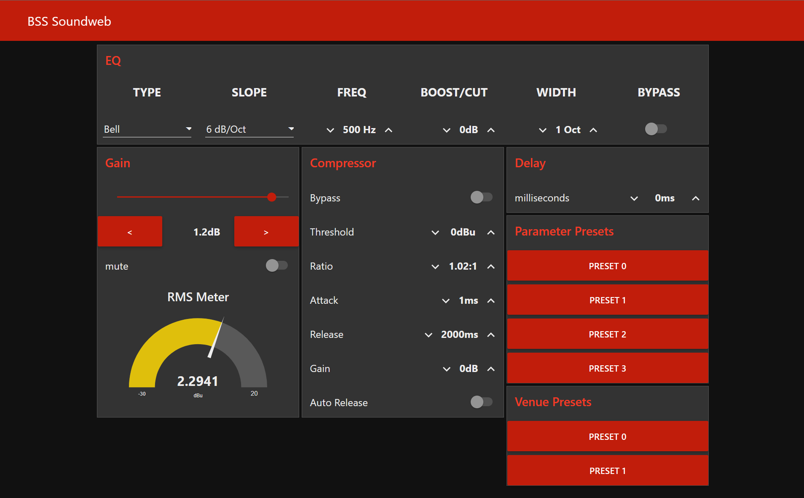

# node-red-contrib-soundweb
A collection of nodes for controlling BSS Soundweb devices.

---

# Getting Started

## Prerequisites

- [Node.js](https://nodejs.org/en/) v12.13.0 or newer
- [Node-RED](https://nodered.org) v3.0.1 or newer

*untested on earlier versions*

## Installation

Install via Node-RED Manage Palette

`node-red-contrib-soundweb`

Install via npm

```
$ cd ~/.node-red
$ npm install node-red-contrib-soundweb
# then restart node-red
```

## Resources

- [Soundweb London DI Kit](https://bssaudio.com/en/site_elements/soundweb-london-di-kit)
- [Soundweb London 3rd Party Control](https://help.harmanpro.com/Documents/135/Soundweb%20London%203rd%20Party%20Control.pdf)

## Feature Requests

Any feature requests can be submitted to the repository's [discussions/ideas](https://github.com/dudest/node-red-contrib-soundweb/discussions/categories/ideas) section.

## Bug Reporting

Please report any bugs or issues to the repository [here](https://github.com/dudest/node-red-contrib-soundweb/issues).

---

# USAGE

## Server Property

**IP address** and **port** of BSS device.

## Address Property

All nodes except `soudweb-venuePresets` and `soundweb-parameterPreset` node require an address be specified. The address property is a buffer of exactly 8 bytes. it is comprised of:

- Node Address (2 bytes)
- Virtual Device (1 byte)
- Object ID (3 bytes)
- Parameter ID (2 bytes)

The following bytes have special meanings. The node suite will automatically handle replacement when commands are encapsulated and decapsulated. Be mindfull on nodes requiring an address property that the **non replaced** character is needed in decimal format. 

| TYPE   | HEX  | DEC  | HEX replacement | DEC replacement |
| ------ |:----:| :---:| :-------------: | :-------------: |
| STX    | 0x02 | 2    | 0x1B, 0x82      | 27, 130         |
| ETX    | 0x03 | 3    | 0x1B, 0x83      | 27, 131         |
| ACK    | 0x06 | 6    | 0x1B, 0x86      | 27, 134         |
| NAK    | 0x15 | 21   | 0x1B, 0x95      | 27, 149         |
| Escape | 0x1B | 27   | 0x1B, 0x9B      | 27, 155         |

## Feedback Subscription

Nodes that subscribe to a variable for feedback will receive updates via their outlets. This is meant to keep their state in sync with the BSS Soundweb unit. By convention, the Soundweb device does not send feedback to the caller.

What this means is: 
- When a control is changed directly from node-red, the Soundweb unit will not send a feedback update.
- When a variable is changed from Audio Architect, London Architect, or some other means, an update will be sent to node-red.
- When a preset is recalled, an update will be sent to all subscribers.

---

# Examples



### Gain Control Example

```
[{"id":"d2ab3aa4da536f58","type":"tab","label":"Gain","disabled":false,"info":"","env":[]},{"id":"6c1a549dfc9ecaec","type":"junction","z":"d2ab3aa4da536f58","x":240,"y":180,"wires":[["6a9f20bc48664b6d"]]},{"id":"399a64d5ae2b8c7e","type":"soundweb-dbGain","z":"d2ab3aa4da536f58","name":"gain","topic":"","server":"452ed4c5da9c7ed8","address":"[0,9,3,0,1,0,0,0]","addressType":"bin","x":290,"y":120,"wires":[["6a9f20bc48664b6d","6e72a5ecec720faa"]]},{"id":"6e72a5ecec720faa","type":"ui_slider","z":"d2ab3aa4da536f58","name":"Gain","label":"","tooltip":"","group":"bf3bb3f9d639b54c","order":1,"width":"0","height":"0","passthru":false,"outs":"all","topic":"topic","topicType":"msg","min":"-80","max":10,"step":"0.1","className":"","x":130,"y":120,"wires":[["399a64d5ae2b8c7e","6c1a549dfc9ecaec"]]},{"id":"40f8dd5453eb9d33","type":"ui_switch","z":"d2ab3aa4da536f58","name":"","label":"mute","tooltip":"","group":"bf3bb3f9d639b54c","order":5,"width":0,"height":0,"passthru":true,"decouple":"false","topic":"topic","topicType":"msg","style":"","onvalue":"1","onvalueType":"num","onicon":"","oncolor":"","offvalue":"0","offvalueType":"num","officon":"","offcolor":"","animate":false,"className":"","x":130,"y":360,"wires":[["a361ce18cb3c1fc7"]]},{"id":"a361ce18cb3c1fc7","type":"soundweb-discrete","z":"d2ab3aa4da536f58","name":"mute","topic":"","server":"452ed4c5da9c7ed8","address":"[0,9,3,0,1,0,0,1]","addressType":"bin","x":290,"y":360,"wires":[["40f8dd5453eb9d33"]]},{"id":"767604665854ba1a","type":"ui_button","z":"d2ab3aa4da536f58","name":"","group":"bf3bb3f9d639b54c","order":2,"width":"2","height":1,"passthru":false,"label":"<","tooltip":"","color":"","bgcolor":"","className":"","icon":"","payload":"1","payloadType":"num","topic":"topic","topicType":"msg","x":130,"y":240,"wires":[["9d3cd3eefa8363ed"]]},{"id":"85bda79e383fdd8d","type":"ui_button","z":"d2ab3aa4da536f58","name":"","group":"bf3bb3f9d639b54c","order":4,"width":"2","height":1,"passthru":false,"label":">","tooltip":"","color":"","bgcolor":"","className":"","icon":"","payload":"1","payloadType":"num","topic":"topic","topicType":"msg","x":130,"y":300,"wires":[["93b01d722d9ce4e4"]]},{"id":"93b01d722d9ce4e4","type":"soundweb-discrete","z":"d2ab3aa4da536f58","name":"bump up","topic":"","server":"452ed4c5da9c7ed8","address":"[0,9,3,0,1,0,0,3]","addressType":"bin","x":300,"y":300,"wires":[[]]},{"id":"9d3cd3eefa8363ed","type":"soundweb-discrete","z":"d2ab3aa4da536f58","name":"bump down","topic":"","server":"452ed4c5da9c7ed8","address":"[0,9,3,0,1,0,0,4]","addressType":"bin","x":310,"y":240,"wires":[[]]},{"id":"7e4ad2b79ea59383","type":"soundweb-dbGain","z":"d2ab3aa4da536f58","name":"meter","topic":"","server":"452ed4c5da9c7ed8","address":"[0,9,3,0,1,3,0,0]","addressType":"bin","x":290,"y":440,"wires":[["47e949c5acc19ece"]]},{"id":"47e949c5acc19ece","type":"ui_gauge","z":"d2ab3aa4da536f58","name":"","group":"bf3bb3f9d639b54c","order":6,"width":0,"height":0,"gtype":"gage","title":"RMS Meter","label":"dBu","format":"{{value}}","min":"-30","max":"20","colors":["#00b500","#e6e600","#ca3838"],"seg1":"","seg2":"","diff":false,"className":"","x":490,"y":440,"wires":[]},{"id":"699ebebb1763f7a4","type":"comment","z":"d2ab3aa4da536f58","name":"Gain example","info":"","x":210,"y":60,"wires":[]},{"id":"6a9f20bc48664b6d","type":"ui_text","z":"d2ab3aa4da536f58","group":"bf3bb3f9d639b54c","order":3,"width":"2","height":"1","name":"gain fb","label":"","format":"{{msg.payload}}dB","layout":"row-spread","className":"","x":470,"y":180,"wires":[]},{"id":"452ed4c5da9c7ed8","type":"soundweb-server","host":"10.0.0.234","port":"1023","connection_logging":true,"communication_logging":false},{"id":"bf3bb3f9d639b54c","type":"ui_group","name":"Gain","tab":"7d1e9ef79062113d","order":2,"disp":true,"width":"6","collapse":false,"className":""},{"id":"7d1e9ef79062113d","type":"ui_tab","name":"BSS Soundweb","icon":"dashboard","disabled":false,"hidden":false}]
```

### Compressor Control Example

```
[{"id":"72d99cfa03d040a3","type":"tab","label":"Compressor","disabled":false,"info":"","env":[]},{"id":"4640b6d3fa5c7984","type":"soundweb-scalarLinear","z":"72d99cfa03d040a3","name":"threshold","topic":"","server":"452ed4c5da9c7ed8","address":"[0,9,3,0,1,2,0,1]","addressType":"bin","x":300,"y":220,"wires":[["8003c160ed4c1730"]]},{"id":"df6dae7a035bd8ea","type":"soundweb-speed","z":"72d99cfa03d040a3","name":"attack","topic":"","server":"452ed4c5da9c7ed8","address":"[0,9,3,0,1,2,0,3]","addressType":"bin","x":290,"y":440,"wires":[["238e57e7792123e4"]]},{"id":"10baba041c3f615c","type":"soundweb-speed","z":"72d99cfa03d040a3","name":"release","topic":"","server":"452ed4c5da9c7ed8","address":"[0,9,3,0,1,2,0,4]","addressType":"bin","x":300,"y":540,"wires":[["3c5907ced2b6d0b4"]]},{"id":"67a3f1da0d7f6b7a","type":"soundweb-scalarLinear","z":"72d99cfa03d040a3","name":"ratio","topic":"","server":"452ed4c5da9c7ed8","address":"[0,9,3,0,1,2,0,2]","addressType":"bin","x":290,"y":340,"wires":[["ea7aed5e085daafb"]]},{"id":"fcc71a001ef1cbc3","type":"soundweb-scalarLinear","z":"72d99cfa03d040a3","name":"gain","topic":"","server":"452ed4c5da9c7ed8","address":"[0,9,3,0,1,2,0,7]","addressType":"bin","x":290,"y":660,"wires":[["c2572c4ee547c0b3"]]},{"id":"425427fe67356d05","type":"soundweb-discrete","z":"72d99cfa03d040a3","name":"auto release","topic":"","server":"452ed4c5da9c7ed8","address":"[0,9,3,0,1,2,0,8]","addressType":"bin","x":310,"y":780,"wires":[["59148c1f7d63927e"]]},{"id":"de53533a8d22545e","type":"soundweb-discrete","z":"72d99cfa03d040a3","name":"bypass","topic":"","server":"452ed4c5da9c7ed8","address":"[0,9,3,0,1,2,0,0]","addressType":"bin","x":300,"y":120,"wires":[["8f3feb89ea5dc13f"]]},{"id":"8f3feb89ea5dc13f","type":"ui_switch","z":"72d99cfa03d040a3","name":"","label":"Bypass","tooltip":"","group":"63eb1d6b748fc43d","order":1,"width":0,"height":0,"passthru":true,"decouple":"false","topic":"topic","topicType":"msg","style":"","onvalue":"1","onvalueType":"num","onicon":"","oncolor":"","offvalue":"0","offvalueType":"num","officon":"","offcolor":"","animate":false,"className":"","x":120,"y":120,"wires":[["de53533a8d22545e"]]},{"id":"8003c160ed4c1730","type":"ui_numeric","z":"72d99cfa03d040a3","name":"","label":"Threshold","tooltip":"","group":"63eb1d6b748fc43d","order":2,"width":0,"height":0,"wrap":false,"passthru":false,"topic":"topic","topicType":"msg","format":"{{value}}dBu","min":"-30","max":"20","step":"0.1","className":"","x":120,"y":220,"wires":[["4640b6d3fa5c7984"]]},{"id":"ea7aed5e085daafb","type":"ui_numeric","z":"72d99cfa03d040a3","name":"","label":"Ratio","tooltip":"","group":"63eb1d6b748fc43d","order":3,"width":0,"height":0,"wrap":false,"passthru":false,"topic":"topic","topicType":"msg","format":"{{value}}:1","min":"1.02","max":"20.1","step":"0.01","className":"","x":110,"y":340,"wires":[["67a3f1da0d7f6b7a"]]},{"id":"238e57e7792123e4","type":"ui_numeric","z":"72d99cfa03d040a3","name":"","label":"Attack","tooltip":"","group":"63eb1d6b748fc43d","order":4,"width":0,"height":0,"wrap":false,"passthru":true,"topic":"topic","topicType":"msg","format":"{{value}}ms","min":"50","max":"200","step":1,"className":"","x":110,"y":440,"wires":[["df6dae7a035bd8ea"]]},{"id":"3c5907ced2b6d0b4","type":"ui_numeric","z":"72d99cfa03d040a3","name":"","label":"Release","tooltip":"","group":"63eb1d6b748fc43d","order":5,"width":0,"height":0,"wrap":false,"passthru":false,"topic":"topic","topicType":"msg","format":"{{value}}ms","min":"5","max":"500","step":1,"className":"","x":120,"y":540,"wires":[["10baba041c3f615c"]]},{"id":"c2572c4ee547c0b3","type":"ui_numeric","z":"72d99cfa03d040a3","name":"","label":"Gain","tooltip":"","group":"63eb1d6b748fc43d","order":6,"width":0,"height":0,"wrap":false,"passthru":true,"topic":"topic","topicType":"msg","format":"{{value}}dB","min":"-20","max":"20","step":1,"className":"","x":110,"y":660,"wires":[["fcc71a001ef1cbc3"]]},{"id":"59148c1f7d63927e","type":"ui_switch","z":"72d99cfa03d040a3","name":"","label":"Auto Release","tooltip":"","group":"63eb1d6b748fc43d","order":7,"width":0,"height":0,"passthru":true,"decouple":"false","topic":"topic","topicType":"msg","style":"","onvalue":"1","onvalueType":"num","onicon":"","oncolor":"","offvalue":"0","offvalueType":"num","officon":"","offcolor":"","animate":false,"className":"","x":140,"y":780,"wires":[["425427fe67356d05"]]},{"id":"98e02e3390500d63","type":"comment","z":"72d99cfa03d040a3","name":"Compressor example","info":"","x":160,"y":40,"wires":[]},{"id":"452ed4c5da9c7ed8","type":"soundweb-server","host":"10.0.0.234","port":"1023","connection_logging":true,"communication_logging":false},{"id":"63eb1d6b748fc43d","type":"ui_group","name":"Compressor","tab":"7d1e9ef79062113d","order":3,"disp":true,"width":"6","collapse":false,"className":""},{"id":"7d1e9ef79062113d","type":"ui_tab","name":"BSS Soundweb","icon":"dashboard","disabled":false,"hidden":false}]
```

### EQ Control Example

```
[{"id":"7d86966d10d47c71","type":"tab","label":"EQ","disabled":false,"info":"","env":[]},{"id":"42562be3ad472680","type":"soundweb-frequency","z":"7d86966d10d47c71","name":"frequency","topic":"","server":"452ed4c5da9c7ed8","address":"[0,9,3,0,1,1,0,1]","addressType":"bin","x":520,"y":300,"wires":[["e976a0c5539b5851"]]},{"id":"b3eb9eeb4c070a9d","type":"soundweb-discrete","z":"7d86966d10d47c71","name":"type","topic":"","server":"452ed4c5da9c7ed8","address":"[0,9,3,0,1,1,0,4]","addressType":"bin","x":510,"y":60,"wires":[["528a8db11ce5f0d3"]]},{"id":"d26184a9d02ae9cd","type":"soundweb-discrete","z":"7d86966d10d47c71","name":"slope","topic":"","server":"452ed4c5da9c7ed8","address":"[0,9,3,0,1,1,0,6]","addressType":"bin","x":510,"y":180,"wires":[["757bf1bf10db5bd2"]]},{"id":"34ee0f196b06612b","type":"soundweb-scalarLinear","z":"7d86966d10d47c71","name":"width","topic":"","server":"452ed4c5da9c7ed8","address":"[0,9,3,0,1,1,0,3]","addressType":"bin","x":510,"y":540,"wires":[["75629b6a0f78c839"]]},{"id":"e9d7d17eeaa5ce79","type":"soundweb-discrete","z":"7d86966d10d47c71","name":"bypass","topic":"","server":"452ed4c5da9c7ed8","address":"[0,9,3,0,1,1,0,0]","addressType":"bin","x":520,"y":680,"wires":[["69645405f0d0d127"]]},{"id":"113ba69ff66db36b","type":"soundweb-scalarLinear","z":"7d86966d10d47c71","name":"boost/cut","topic":"","server":"452ed4c5da9c7ed8","address":"[0,9,3,0,1,1,0,2]","addressType":"bin","x":520,"y":420,"wires":[["43dec873f13af530"]]},{"id":"75629b6a0f78c839","type":"ui_numeric","z":"7d86966d10d47c71","name":"Width 1","label":"","tooltip":"","group":"d0210edf282b4ca2","order":11,"width":"3","height":1,"wrap":false,"passthru":false,"topic":"topic","topicType":"msg","format":"{{value}} Oct","min":"0.01","max":"4","step":"0.01","className":"","x":340,"y":540,"wires":[["34ee0f196b06612b"]]},{"id":"528a8db11ce5f0d3","type":"ui_dropdown","z":"7d86966d10d47c71","name":"Type 1","label":"","tooltip":"","place":"Select option","group":"d0210edf282b4ca2","order":7,"width":"3","height":1,"passthru":false,"multiple":false,"options":[{"label":"Bell","value":0,"type":"num"},{"label":"Low Shelf","value":1,"type":"num"},{"label":"High Shelf","value":2,"type":"num"}],"payload":"","topic":"topic","topicType":"msg","className":"","x":330,"y":60,"wires":[["b3eb9eeb4c070a9d"]]},{"id":"757bf1bf10db5bd2","type":"ui_dropdown","z":"7d86966d10d47c71","name":"Slope 1","label":"","tooltip":"","place":"Select option","group":"d0210edf282b4ca2","order":8,"width":"3","height":1,"passthru":false,"multiple":false,"options":[{"label":"6 dB/Oct","value":0,"type":"num"},{"label":"9 dB/Oct","value":1,"type":"num"},{"label":"12 dB/Oct","value":2,"type":"num"},{"label":"15 dB/Oct","value":3,"type":"num"}],"payload":"","topic":"topic","topicType":"msg","className":"","x":340,"y":180,"wires":[["d26184a9d02ae9cd"]]},{"id":"e976a0c5539b5851","type":"ui_numeric","z":"7d86966d10d47c71","name":"frequency 1","label":"","tooltip":"","group":"d0210edf282b4ca2","order":9,"width":"3","height":1,"wrap":false,"passthru":false,"topic":"topic","topicType":"msg","format":"{{value}} Hz","min":"-20","max":"20000","step":1,"className":"","x":350,"y":300,"wires":[["42562be3ad472680"]]},{"id":"69645405f0d0d127","type":"ui_switch","z":"7d86966d10d47c71","name":"Bypass 1","label":"","tooltip":"","group":"d0210edf282b4ca2","order":12,"width":"3","height":1,"passthru":true,"decouple":"false","topic":"topic","topicType":"msg","style":"","onvalue":"1","onvalueType":"num","onicon":"","oncolor":"","offvalue":"0","offvalueType":"num","officon":"","offcolor":"","animate":false,"className":"","x":340,"y":680,"wires":[["e9d7d17eeaa5ce79"]]},{"id":"43dec873f13af530","type":"ui_numeric","z":"7d86966d10d47c71","name":"Boost/Cut 1","label":"","tooltip":"","group":"d0210edf282b4ca2","order":10,"width":"3","height":1,"wrap":false,"passthru":false,"topic":"topic","topicType":"msg","format":"{{value}}dB","min":"-20","max":"20","step":1,"className":"","x":350,"y":420,"wires":[["113ba69ff66db36b"]]},{"id":"c42bb665ace5063d","type":"ui_template","z":"7d86966d10d47c71","group":"d0210edf282b4ca2","name":"type label","order":1,"width":"3","height":"1","format":"<div><h3 style=\"text-align:center\">TYPE</h3></div>","storeOutMessages":true,"fwdInMessages":true,"resendOnRefresh":true,"templateScope":"local","className":"","x":120,"y":60,"wires":[[]]},{"id":"64c12d54b80b87db","type":"ui_template","z":"7d86966d10d47c71","group":"d0210edf282b4ca2","name":"slope label","order":2,"width":"3","height":"1","format":"<div><h3 style=\"text-align:center\">SLOPE</h3></div>","storeOutMessages":true,"fwdInMessages":true,"resendOnRefresh":true,"templateScope":"local","className":"","x":130,"y":180,"wires":[[]]},{"id":"eaf23cbb8c0ecae4","type":"ui_template","z":"7d86966d10d47c71","group":"d0210edf282b4ca2","name":"frequency label","order":3,"width":"3","height":"1","format":"<div><h3 style=\"text-align:center\">FREQ</h3></div>","storeOutMessages":true,"fwdInMessages":true,"resendOnRefresh":true,"templateScope":"local","className":"","x":140,"y":300,"wires":[[]]},{"id":"2318ac8dfda8c9a2","type":"ui_template","z":"7d86966d10d47c71","group":"d0210edf282b4ca2","name":"boost/cut label","order":4,"width":"3","height":"1","format":"<div><h3 style=\"text-align:center\">BOOST/CUT</h3></div>","storeOutMessages":true,"fwdInMessages":true,"resendOnRefresh":true,"templateScope":"local","className":"","x":140,"y":420,"wires":[[]]},{"id":"16358859632df4f9","type":"ui_template","z":"7d86966d10d47c71","group":"d0210edf282b4ca2","name":"width label","order":5,"width":"3","height":"1","format":"<div><h3 style=\"text-align:center\">WIDTH</h3></div>","storeOutMessages":true,"fwdInMessages":true,"resendOnRefresh":true,"templateScope":"local","className":"","x":130,"y":540,"wires":[[]]},{"id":"d553c831253eaf5b","type":"ui_template","z":"7d86966d10d47c71","group":"d0210edf282b4ca2","name":"bypass label","order":6,"width":"3","height":"1","format":"<div><h3 style=\"text-align:center\">BYPASS</h3></div>","storeOutMessages":true,"fwdInMessages":true,"resendOnRefresh":true,"templateScope":"local","className":"","x":130,"y":680,"wires":[[]]},{"id":"452ed4c5da9c7ed8","type":"soundweb-server","host":"10.0.0.234","port":"1023","connection_logging":true,"communication_logging":false},{"id":"d0210edf282b4ca2","type":"ui_group","name":"EQ","tab":"7d1e9ef79062113d","order":1,"disp":true,"width":18,"collapse":false,"className":""},{"id":"7d1e9ef79062113d","type":"ui_tab","name":"BSS Soundweb","icon":"dashboard","disabled":false,"hidden":false}]
```

### Delay Control Example

```
[{"id":"c5af03cd655f133d","type":"tab","label":"Delay","disabled":false,"info":"","env":[]},{"id":"02dae25ee605f779","type":"soundweb-delay","z":"c5af03cd655f133d","name":"ms","topic":"","server":"452ed4c5da9c7ed8","address":"[0,9,3,0,1,5,0,0]","addressType":"bin","x":310,"y":120,"wires":[["0614a7d1ee79a437"]]},{"id":"0614a7d1ee79a437","type":"ui_numeric","z":"c5af03cd655f133d","name":"","label":"milliseconds","tooltip":"","group":"1b14978560f30b2b","order":1,"width":0,"height":0,"wrap":false,"passthru":false,"topic":"topic","topicType":"msg","format":"{{value}}ms","min":0,"max":10,"step":"0.001","className":"","x":150,"y":120,"wires":[["02dae25ee605f779"]]},{"id":"452ed4c5da9c7ed8","type":"soundweb-server","host":"10.0.0.234","port":"1023","connection_logging":true,"communication_logging":false},{"id":"1b14978560f30b2b","type":"ui_group","name":"Delay","tab":"7d1e9ef79062113d","order":4,"disp":true,"width":"6","collapse":false,"className":""},{"id":"7d1e9ef79062113d","type":"ui_tab","name":"BSS Soundweb","icon":"dashboard","disabled":false,"hidden":false}]
```

### Preset Recall Example

```
[{"id":"748242db03ab0c24","type":"tab","label":"Presets","disabled":false,"info":"","env":[]},{"id":"2661d2125651aeb9","type":"junction","z":"748242db03ab0c24","x":200,"y":220,"wires":[["d468009d0f201754"]]},{"id":"1c3ad718a0a58de4","type":"junction","z":"748242db03ab0c24","x":200,"y":360,"wires":[["3adde43106b84b26"]]},{"id":"d468009d0f201754","type":"soundweb-parameterPresets","z":"748242db03ab0c24","name":"","topic":"","server":"452ed4c5da9c7ed8","x":360,"y":220,"wires":[]},{"id":"a56686efc5886604","type":"ui_button","z":"748242db03ab0c24","name":"","group":"468ac21e0d32a8e4","order":1,"width":0,"height":0,"passthru":false,"label":"Preset 0","tooltip":"","color":"","bgcolor":"","className":"","icon":"","payload":"0","payloadType":"num","topic":"topic","topicType":"msg","x":80,"y":160,"wires":[["2661d2125651aeb9"]]},{"id":"900fcf928c3cb316","type":"ui_button","z":"748242db03ab0c24","name":"","group":"468ac21e0d32a8e4","order":2,"width":0,"height":0,"passthru":false,"label":"Preset 1","tooltip":"","color":"","bgcolor":"","className":"","icon":"","payload":"1","payloadType":"num","topic":"topic","topicType":"msg","x":80,"y":200,"wires":[["2661d2125651aeb9"]]},{"id":"d2973e477450d7ec","type":"ui_button","z":"748242db03ab0c24","name":"","group":"468ac21e0d32a8e4","order":3,"width":0,"height":0,"passthru":false,"label":"Preset 2","tooltip":"","color":"","bgcolor":"","className":"","icon":"","payload":"2","payloadType":"num","topic":"topic","topicType":"msg","x":80,"y":240,"wires":[["2661d2125651aeb9"]]},{"id":"68dd21b95d7593be","type":"ui_button","z":"748242db03ab0c24","name":"","group":"468ac21e0d32a8e4","order":4,"width":0,"height":0,"passthru":false,"label":"Preset 3","tooltip":"","color":"","bgcolor":"","className":"","icon":"","payload":"3","payloadType":"num","topic":"topic","topicType":"msg","x":80,"y":280,"wires":[["2661d2125651aeb9"]]},{"id":"3adde43106b84b26","type":"soundweb-venuePresets","z":"748242db03ab0c24","name":"","topic":"","server":"452ed4c5da9c7ed8","x":350,"y":360,"wires":[]},{"id":"1b8914ed86493b5e","type":"ui_button","z":"748242db03ab0c24","name":"","group":"62bb4bb26496d012","order":1,"width":0,"height":0,"passthru":false,"label":"Preset 0","tooltip":"","color":"","bgcolor":"","className":"","icon":"","payload":"0","payloadType":"num","topic":"topic","topicType":"msg","x":80,"y":340,"wires":[["1c3ad718a0a58de4"]]},{"id":"5721f58c69d98aee","type":"ui_button","z":"748242db03ab0c24","name":"","group":"62bb4bb26496d012","order":2,"width":0,"height":0,"passthru":false,"label":"Preset 1","tooltip":"","color":"","bgcolor":"","className":"","icon":"","payload":"1","payloadType":"num","topic":"topic","topicType":"msg","x":80,"y":380,"wires":[["1c3ad718a0a58de4"]]},{"id":"78173526ceb28fa8","type":"comment","z":"748242db03ab0c24","name":"Preset example","info":"","x":280,"y":100,"wires":[]},{"id":"452ed4c5da9c7ed8","type":"soundweb-server","host":"10.0.0.234","port":"1023","connection_logging":true,"communication_logging":false},{"id":"468ac21e0d32a8e4","type":"ui_group","name":"Parameter Presets","tab":"7d1e9ef79062113d","order":5,"disp":true,"width":"6","collapse":false,"className":""},{"id":"62bb4bb26496d012","type":"ui_group","name":"Venue Presets","tab":"7d1e9ef79062113d","order":6,"disp":true,"width":"6","collapse":false,"className":""},{"id":"7d1e9ef79062113d","type":"ui_tab","name":"BSS Soundweb","icon":"dashboard","disabled":false,"hidden":false}]
```